# Attack Tree Application

## Description

This application provides a GUI interface which allows the user to add nodes to make up an attack tree and export it as a PNG file. Each node has a name, a description of the attack, its parent and the value. Furthermore, the application allows the user to calculate the attack score from a specific node to the root node. In addition, the user can also import an attack tree from a predefined JSON or XML file.

The application is written in Python using graphviz for display graphs and tkinter library for the GUI.

## Table of Contents

- [External Libraries](#external-libraries)
- [Compiling the project from source and running it on Windows](#compiling-the-project-from-source-and-running-it-on-windows)
- [Usage](#usage)
  - [Add a new node](#add-a-new-node)
  - [Adding nodes example](#adding-nodes-example)
  - [Remove a node](#remove-a-node)
  - [Clear the graph](#clear-the-graph)
  - [Calculate the attack value of the root node](#calculate-the-attack-value-of-the-root-node)
  - [Import a graph from XML/JSON](#import-a-graph-from-xml-json)
- [Supported File formats](#supported-file-formats)
  - [XML file format](#xml-file-format)
  - [JSON file format](#json-file-format)
- [Tests](#tests)
- [Pampered-Pets Risk Assessment](#pampered-pets-risk-assessment)
  - [Risk rating table](#risk-rating-table)
  - [Pre digitized Pampered-Pets graph](#pre-digitized-pampered-pets-graph)
  - [Post digitized Pampered-Pets graph](#post-digitized-pampered-pets-graph)
  - [Consultation](#consultation)
- [License](#license)
- [References](#references)

### External Libraries 

This application uses the following libraries:

- graphviz (Graphviz): This library allows users to create graphs and view them as png, pdf or svg.
- Tkinter (Tkinter - Python interface to TCL/TK 2023): This library allows the user to create graphic user interfaces in Python.

## Compiling the project from source and running it on Windows

To compile and run this application on Windows, the following steps must be followed:

1. Install Graphviz by going to the following website and download the 64 bit version
   1. https://graphviz.org/download/
   2. Make sure to select the “Add Graphviz to the system PATH for all users” option when installing it
   3. 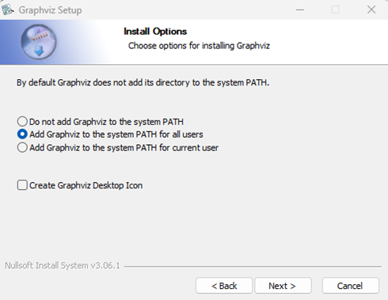
2. Install Graphviz using pip by running the following command.
      ~~~
      pip install graphviz
      ~~~
3. Open the terminal and navigate to the project directory and run the following command
      ~~~
      python3 app.py
      ~~~

## Usage

Once you run the application, it should look like this:
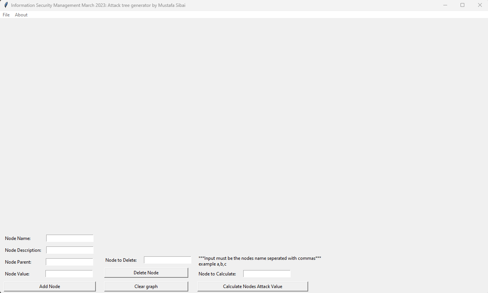

## Add a new node
1. You may add a node by specifying the node name. 
   1. Keep the node names short. For example, you could use A1 and A2 as node names. This is because it becomes really tedious to type the node parent name every time you create a new node.
2. Add the node description. This can be long and can describe what the node does.
3. If this is the root node, leave the "Node Parent" and "value" fields empty. Otherwise, fill those up.
4. 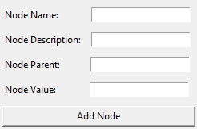

## Adding nodes example
Here is an example of what it looks like after you add four nodes
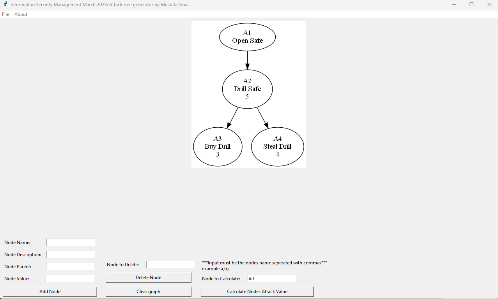

## Remove a node
1. Type the node name you want to remove and press the "Delete Node" button.
2. If the node has any children, all the children will also be removed.
3. 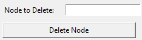

## Clear the graph
1. To clear the graph, simply click the "Clear graph" button, which should remove everything.
2. 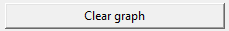

## Calculate the attack value of the root node
1. To calculate the attack value of the root node, add the node names separated by a comma in the "Node To Calculate" textbox.
2. You must start from the root node until you reach the goal node; otherwise, the program will display an error message.
3. Press the "Calculate Nodes Attack Value" button.
4. Once the button is pressed, the path from the root node to the end node will be highlighted in red, and the root node value will be calculated based on the child node's path. In the below example opening the safe costs nine because drilling the safe costs five and stealing a drill costs 4. So 4 + 5 = 9.
5. 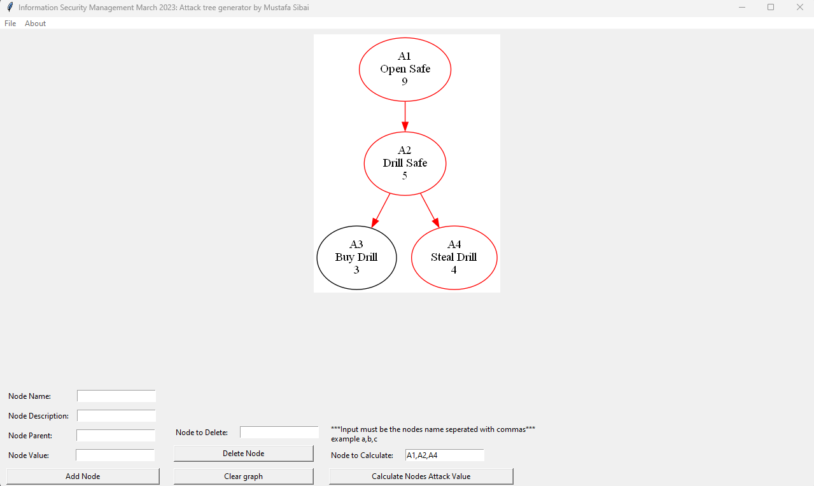

## Import a graph from XML JSON
To import a graph from XML or JSON follow the below steps:
1. Click on "File"
2. Click on "Import From a File"
3. Change the file format at the bottom right of the window
4. Select an XML or JSON file
5. Click on "Open"
6. 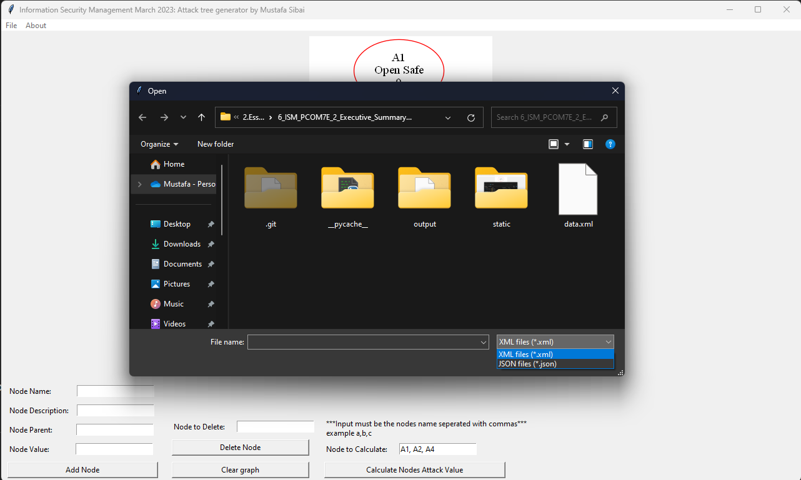

## Export graph to PNG
To export the graph created to a png file, following the below steps
1. Click on File
2. Click on Export As
3. Select PNG
4. Select the desired location to save the PNG file
5. Name the png file
6. Click on Save
7. 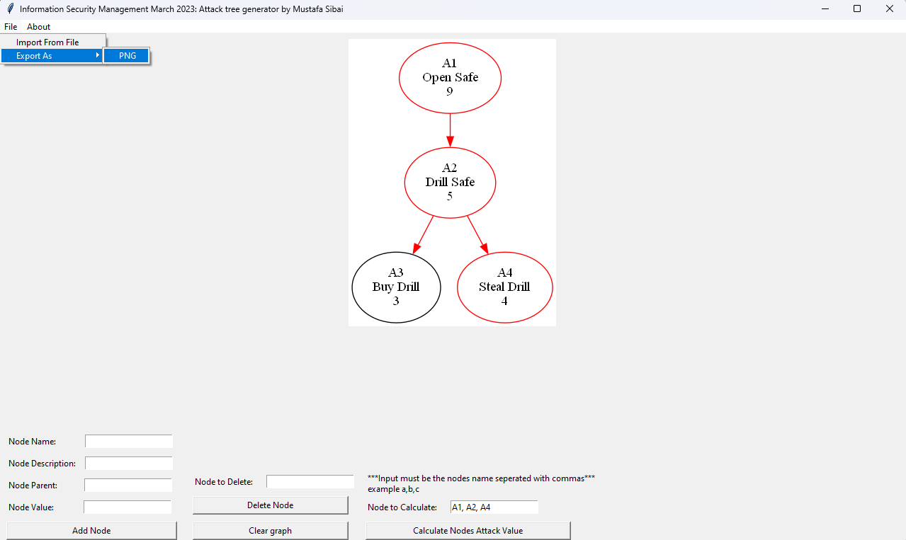
8. 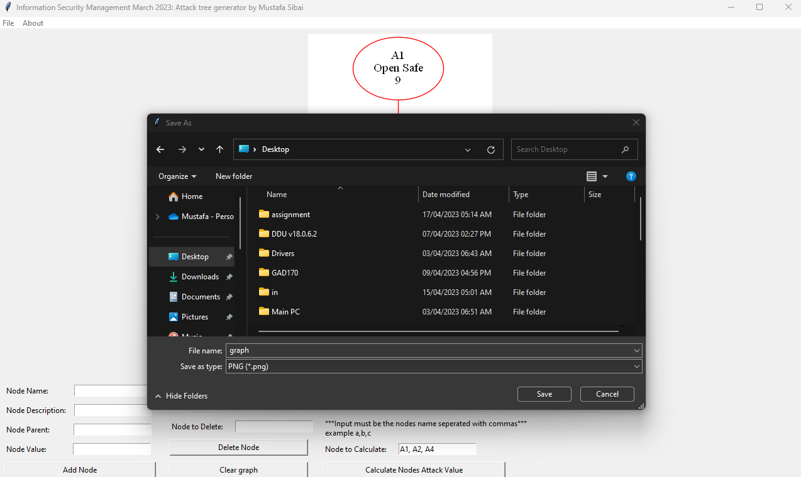

### Supported File formats

## XML file format
The application supports importing a graph through XML (World Wide Web Consortium (W3C), 2008) file format. The file format looks as follows:
~~~
<node name="A1" description="Open Safe" value="0">
    <node name="A2" description="Drill Safe" value="5">
        <node name="A3" description="Buy Drill" value="3"/>
        <node name="A4" description="Steal Drill" value="4"/>
    </node>
</node>
~~~

1. Each XML element must be called a node and should contain the following attributes name, description, and value.
2. Each XML element can have a child element.

## JSON file format
The application supports importing a graph through JSON (JSON.org, 2021) file format. The file format looks as follows:
~~~
{
    "name": "A1",
    "description": "Open Safe",
    "value": 0,
    "children": [
        {
            "name": "A2",
            "description": "Drill Safe",
            "value": 5,
            "children": [
                {
                    "name": "A3",
                    "description": "Buy Drill",
                    "value": 3,
                    "children": []
                },
                {
                    "name": "A4",
                    "description": "Steal Drill",
                    "value": 4,
                    "children": []
                }
            ]
        }
    ]
}
~~~

1. Each node has a name, description, value and an array of children nodes
2. As discussed previously, the root node has no value. However, the child nodes must contain a value.

## Tests
For unit tests I am using the built in unittest framework (Python Software Foundation, 2021).
To run the unit tests execute the following command in the terminal

~~~
python3 unittest.test.py
~~~

# Pampered-Pets Risk Assessment

## Risk rating table

| Scale                                 | Value         |
| ------------------------------------- |:-------------:|
| Very high                             | 10            |
| High                                  | 8             |
| Moderate                              | 5             |
| Low                                   | 2             |
| Very low                              | 0             |

## Pre digitized Pampered-Pets graph
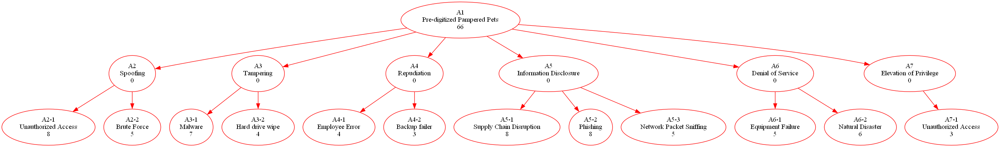

The below string can be pasted into the "Node To Calculate" textbox in the application after loading the XML file and pressing the "Calculate Nodes Attack Value" button to calculate the likelihood of all attacks happening.

A1,A2,A2-1,A2-2,A3,A3-1,A3-2,A4,A4-1,A4-2,A5,A5-1,A5-2,A5-3,A6,A6-1,A6-2,A7,A7-1

 

## Post digitized Pampered-Pets graph
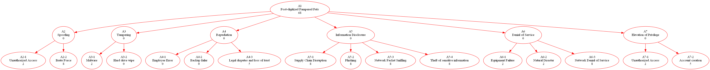

The below string can be pasted into the "Node To Calculate" textbox in the application after loading the XML file and pressing the "Calculate Nodes Attack Value" button to calculate the likelihood of all attacks happening.

A1,A2,A2-1,A2-2,A3,A3-1,A3-2,A4,A4-1,A4-2,A4-3,A5,A5-1,A5-2,A5-3,A5-4,A6,A6-1,A6-2,A6-3,A7,A7-1,A7-2

## Consultation

As you can clearly see, the overall risk score is high post-digitisation, while pre digitisation risk score is lower. This is because creating an online platform allows hackers and attackers to disrupt business operations.

## License

MIT License (MIT)

Copyright (c) 2023 Mustafa Sibai

Permission is hereby granted, free of charge, to any person obtaining a copy  of this software and associated documentation files (the "Software"), to deal  in the Software without restriction, including without limitation the rights to use, copy, modify, merge, publish, distribute, sublicense, and/or sell copies of the Software, and to permit persons to whom the Software is 
furnished to do so, subject to the following conditions:

The above copyright notice and this permission notice shall be included in all copies or substantial portions of the Software.

THE SOFTWARE IS PROVIDED "AS IS", WITHOUT WARRANTY OF ANY KIND, EXPRESS OR IMPLIED, INCLUDING BUT NOT LIMITED TO THE WARRANTIES OF MERCHANTABILITY,  FITNESS FOR A PARTICULAR PURPOSE AND NONINFRINGEMENT. IN NO EVENT SHALL THE AUTHORS OR COPYRIGHT HOLDERS BE LIABLE FOR ANY CLAIM, DAMAGES OR OTHER
LIABILITY, WHETHER IN AN ACTION OF CONTRACT, TORT OR OTHERWISE, ARISING FROM, OUT OF OR IN CONNECTION WITH THE SOFTWARE OR THE USE OR OTHER DEALINGS IN THE SOFTWARE.

## References

Graphviz (2023) Graphviz. Available at: https://graphviz.org/ (Accessed: April 16, 2023). 

Tkinter - Python interface to TCL/TK (no date) Python documentation. Available at: https://docs.python.org/3/library/tkinter.html (Accessed: April 16, 2023).

World Wide Web Consortium (W3C). (2008). Extensible Markup Language (XML) 1.0 (Fifth Edition). W3C. https://www.w3.org/TR/REC-xml/

JSON.org. (2021). JSON: JavaScript Object Notation. http://json.org/

Python Software Foundation. (2021). unittest — Unit testing framework. Python Software Foundation. https://docs.python.org/3/library/unittest.html